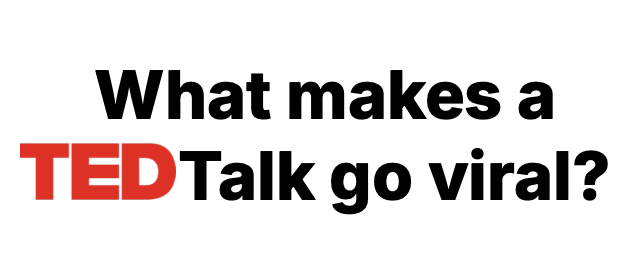
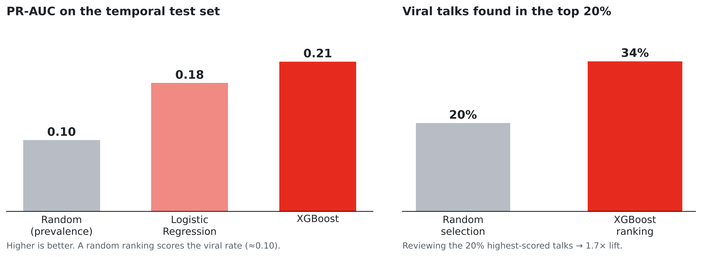
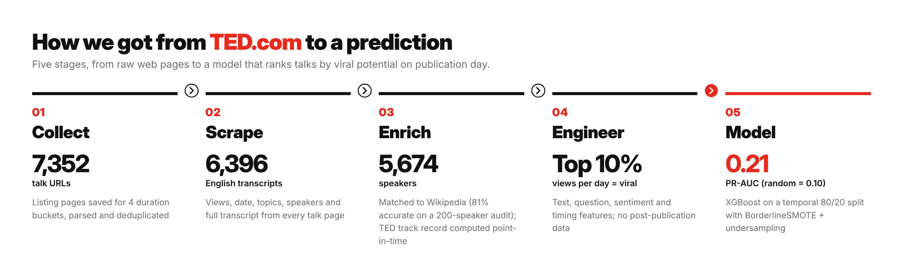
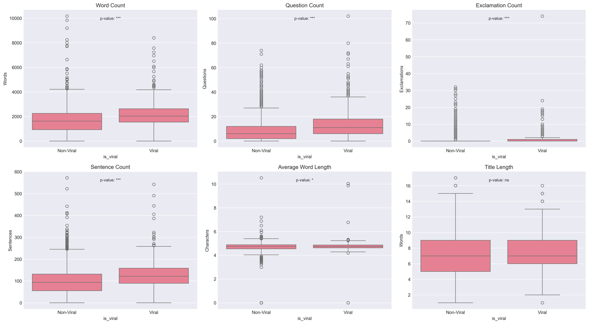
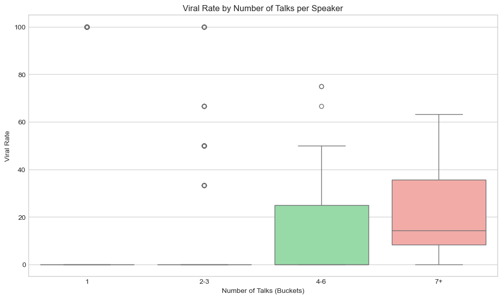
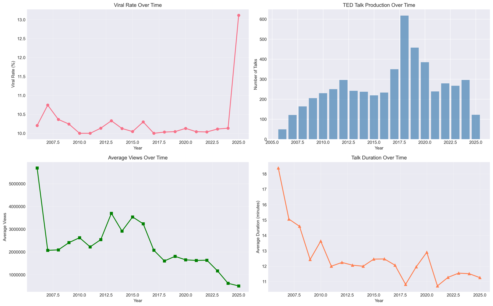
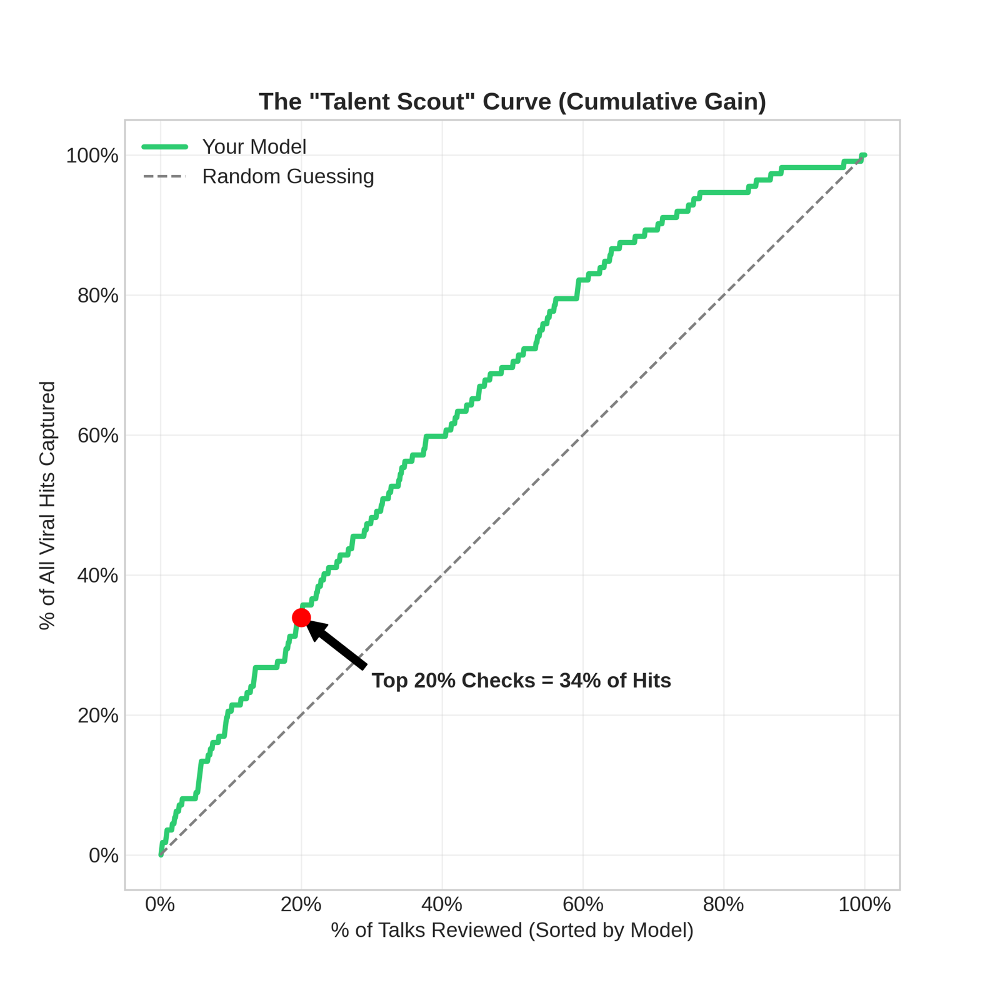

<div align="center">



**Scraping 7,352 TED talks and predicting which ones break out, using only what is known on publication day**


*DALAS (Data Science, Learning and Applications), M1 Computer Science, Sorbonne Université, January 2026*

[**Report**](reports/DALAS_report.pdf) · [**Slides**](reports/DALAS_slides.pdf)

</div>

---

## TL;DR

| | |
|---|---|
| **Data** | 7,352 talks scraped from ted.com (2006–2024), 6,396 with English transcripts; 5,674 speakers, 2,797 matched to Wikipedia |
| **Target** | *Viral* = top 10% of talks by **views per day** since publication |
| **Setup** | Temporal 80/20 split (train on older talks, test on newer ones), point-in-time speaker features, no post-publication engagement data as inputs |
| **Best model** | XGBoost: **PR-AUC 0.21** vs 0.10 for a random ranking; recall 73%, precision 18% |
| **In practice** | The 20% of talks the model ranks highest contain **34% of the viral talks (1.7× lift)** |

<p align="center">
  
</p>

---

## Pipeline

<p align="center"></p>

## Data collection

TED.com sorts its catalogue into four duration buckets (0–6, 6–12, 12–18 and 18+ minutes). We saved the listing pages, extracted talk URLs and basic metadata from the raw HTML, merged the four buckets and removed the talks listed in more than one bucket. We then scraped every talk page (the embedded `__NEXT_DATA__` JSON plus the `/transcript` page) with a 2–3 second delay between requests, respecting `robots.txt`.

Each speaker was then looked up on Wikipedia (occupation, birth date, summary). We hand-checked **200 randomly sampled speakers: 81% were matched to the right page**, so Wikipedia features are treated as noisy, supplementary signals.

## What the data shows

**Viral talks say more and ask more.** Viral talks have higher word, sentence and question counts (p < 0.001). Title length makes no difference.

<p align="center"></p>

**TED track record matters; outside fame doesn't.** Speakers without a Wikipedia page actually have a *higher* average popularity score (1,505 vs 1,263). What does matter is experience on the platform: speakers with 7+ TED talks reach a median viral rate of 15%, while most speakers sit near zero.

<p align="center"></p>

**TED talks keep getting shorter.** Average duration fell from about 18 minutes in 2006 to about 11 in 2024. Average views per talk fell over the same period.

<p align="center"></p>

The effects are real but small: viral and non-viral talks overlap heavily on every single feature. Virality looks like an accumulation of weak signals, with no single deciding factor.

## Modelling choices

- **No leakage from the future.** Only information available at publication is used. Speaker features are computed **point-in-time** (`viral_rate_before_video` only counts a speaker's earlier talks).
- **Temporal split.** Train on the oldest 80% of talks, test on the most recent 20%, which mimics scoring a talk on release day.
- **Imbalance (≈10% positives).** BorderlineSMOTE combined with random undersampling.
- **Metric.** PR-AUC and cumulative gain instead of accuracy. Predicting "never viral" already gives 90% accuracy, so accuracy says nothing here.

## Results

| Model | PR-AUC | Recall | Precision | F1 |
|---|---|---|---|---|
| Random baseline | 0.10 | 10% | 10% | 0.10 |
| Logistic Regression | 0.18 | 52% | 15% | 0.23 |
| **XGBoost** | **0.21** | **73%** | **18%** | **0.29** |

<p align="center"></p>

**How to read this:** the model finds most viral talks (73% recall), but fewer than 1 in 5 talks it flags actually go viral. Its value is as a **ranking / triage tool**: reviewing the model's top 20% surfaces 1.7× more viral talks than reviewing a random 20%. It is not a reliable yes/no classifier. Virality depends heavily on things a pre-publication model cannot see, such as promotion, recommendation algorithms and current events.

## Limitations

- Virality is treated as a binary label, which ignores how continuous popularity really is.
- About 1 in 5 Wikipedia matches is likely wrong (81% accuracy on the audited sample), which adds noise to speaker features.
- No visual or delivery features (stage presence, thumbnails, production quality) and no recommendation-algorithm or social-media data.
- Favouring speakers with a high past viral rate could create a feedback loop that advantages already-established speakers.
- Notebooks `07` and `08` are earlier modelling iterations on a random split. The final temporal-split model and its results are described in the [report](reports/DALAS_report.pdf).

## Repository structure

```
DALAS_project/
├── notebooks/
│   ├── 01_gathering.ipynb            # parse listing pages → URL list, dedupe
│   ├── 02_scraping_prototype.ipynb   # first scraper (10-talk test)
│   ├── 03_scraping.ipynb             # full scraper: metadata + transcripts
│   ├── 04_speakers.ipynb             # speaker-level aggregation
│   ├── 05_preprocessing.ipynb        # cleaning, feature engineering, target
│   ├── 06_eda.ipynb                  # early exploratory analysis
│   ├── 07_model_baseline.ipynb       # first models (LogReg, RF, XGBoost)
│   └── 08_training.ipynb             # imbalance experiments, model comparison
├── data/
│   ├── raw/listing_pages/            # saved ted.com listing HTML (.rtf)
│   ├── interim/                      # URL lists, scraped talk data
│   ├── processed/                    # cleaned datasets (+ speakers/)
│   └── model/                        # temporal train/test split
├── figures/                          # report, EDA, training and results plots
├── reports/                          # report + slides (PDF), notebook JSON outputs
└── requirements.txt
```

## Run it

```bash
git clone https://github.com/ccaglaa/DALAS_project.git
cd DALAS_project
pip install -r requirements.txt
jupyter lab notebooks/
```

The notebooks use paths relative to `notebooks/`, so run them from that folder. The processed datasets are committed, so you can skip scraping and start from the processed data. Re-scraping depends on ted.com's current page structure, which may have changed.

## Authors

**Çağla Koprulu** ([@ccaglaa](https://github.com/ccaglaa)) and **Lina Mnemoi** ([@linabdn](https://github.com/linabdn))

*Data was scraped from ted.com for a non-commercial university project. TED talks and transcripts remain © TED Conferences LLC.*
